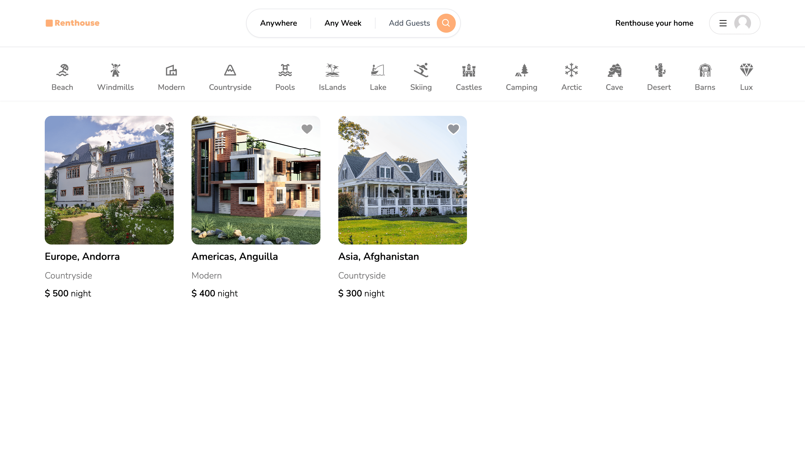
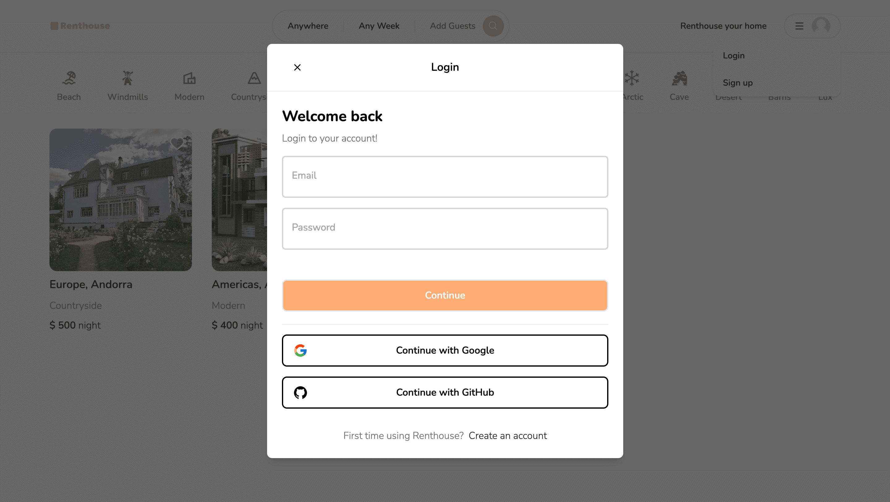

# 租房網站專案

模擬 AirBnB 訂房網站的全端專案

## 關於租房網站專案

1.使用 Next.js 13 ( App Router )、React Hook、TypeScript 開發全站  
2.使用 zustand 管理狀態  
3.使用 Tailwind CSS 完成 RWD Web Layout  
4.使用 Prisma 作為與 MongoDB 串連的 ORM 並設定關聯性，完成 NoSQL 操作  
5.使用 NextAuth.js 完成 authentication，包含 Google、GitHub OAuth 登入系統  
6.使用 Next-cloudinary 管理圖片資源  
7.使用 react-spinners 套件開發客製化動畫  
8.使用 Vercel 完成部署
